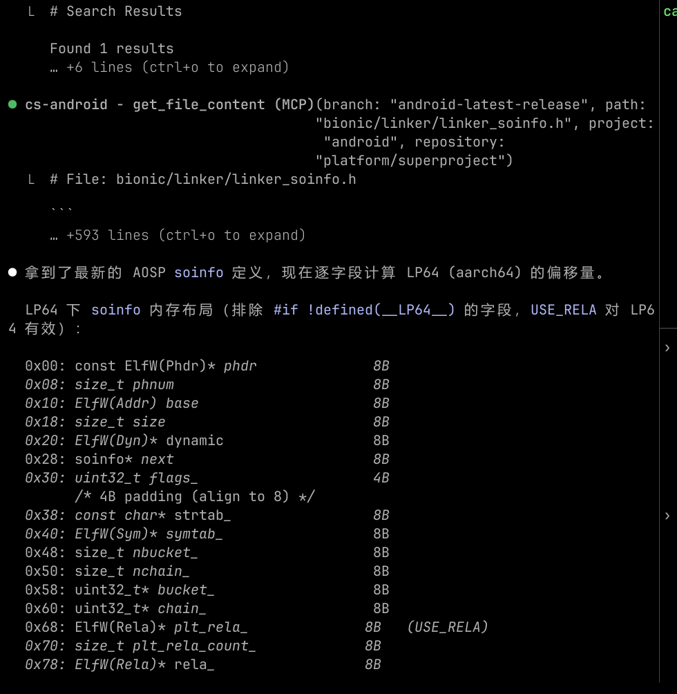

# Android Code Search MCP Server

[](https://www.npmjs.com/package/cs-android-mcp)
[](https://www.npmjs.com/package/cs-android-mcp)
[](https://github.com/steveday763/cs_android_mcp)
[](https://opensource.org/licenses/MIT)

[English](README.md) | 简体中文

一个用于搜索和浏览 Android 源码的 MCP (Model Context Protocol) 服务器，数据源自 cs.android.com。

## 效果预览



## 功能

- **代码搜索** — 支持正则表达式搜索 Android 源码
- **文件内容** — 获取完整的源文件内容
- **符号建议** — 根据部分输入自动补全类名、方法名、文件名
- **多项目支持** — 可搜索 Android、AndroidX、Android Studio、LLVM 等项目

## 安装

### Claude Code

```bash
claude mcp add cs-android -- npx -y cs-android-mcp
```

### Cursor

```json
{
  "mcpServers": {
    "cs-android": {
      "command": "npx",
      "args": ["-y", "cs-android-mcp"]
    }
  }
}
```

### 其他 MCP 客户端

任何兼容 MCP 协议的客户端均可通过 stdio 接入：

```bash
npx -y cs-android-mcp
```

或全局安装后使用：

```bash
npm install -g cs-android-mcp
cs-android-mcp
```

## 可用工具

### search_android_code

在 Android 源码仓库中搜索代码。

| 参数 | 必填 | 说明 |
|---|---|---|
| `query` | 是 | 搜索查询（支持正则、`file:`、`class:`、`function:` 等操作符） |
| `project` | 否 | 按项目过滤：`android`、`androidx`、`android-studio`、`android-llvm` |
| `pageSize` | 否 | 返回结果数量（默认 10，最大 50） |
| `contextLines` | 否 | 匹配行的上下文行数（默认 1） |

### get_file_content

获取源文件的完整内容。

| 参数 | 必填 | 说明 |
|---|---|---|
| `project` | 是 | 项目名称 |
| `repository` | 是 | 仓库路径 |
| `branch` | 是 | 分支名称 |
| `path` | 是 | 文件路径 |

### suggest_symbols

根据部分输入获取符号建议。

| 参数 | 必填 | 说明 |
|---|---|---|
| `query` | 是 | 部分查询字符串 |
| `maxResults` | 否 | 最大建议数量（默认 7） |

### list_projects

列出所有可搜索的 Android 源码项目。

## 许可证

MIT
